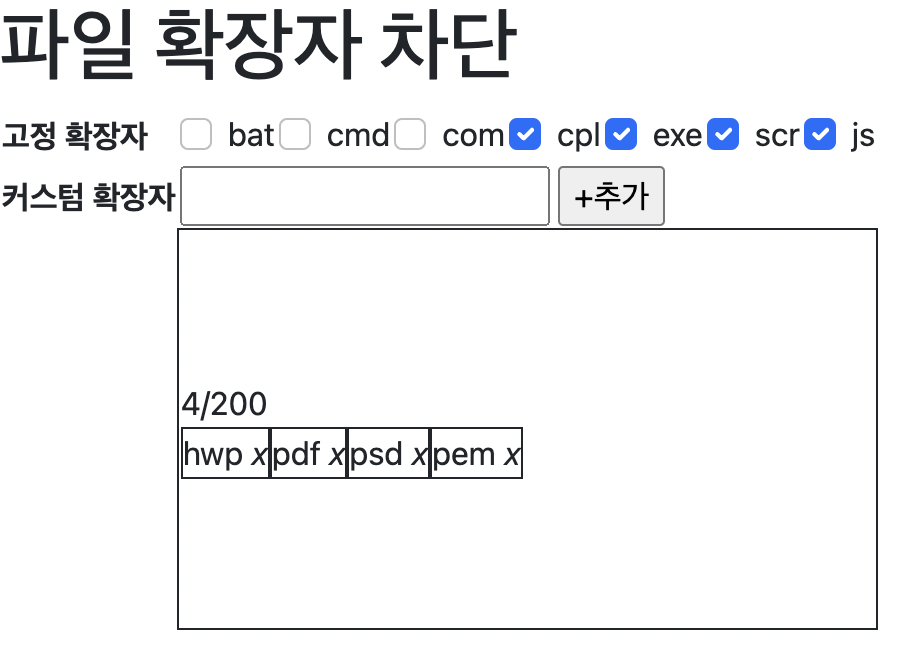

# 파일 확장자 차단

### 설명
어떤 파일들은 첨부시 보안에 문제가 될 수 있습니다. 특히 exe, sh 등의 실행 파일이 존재할 경우 서버에 올려서 실행이 될 수 있는 위험이 있어 파일 확장자 차단을 하게 되었습니다.

### 요건
1-1. 고정 확장자는 차단을 자주하는 확장자 리스트이며, default는 unCheck되어져 있습니다.   
1-2. 고정 확장자는 check or uncheck를 할 경우 db에 저장됩니다. 새로고침시 유지되어야 합니다.   
   
2-1. 확장자 최대 입력 길이는 20자리   
2-2. 추가 버튼 클릭시 DB 저장되며, 아래쪽 영역에 표현됩니다.   
   
3-1. 커스텀 확장자는 최대 200개까지 추가가 가능   
3-2. 확장자 옆 X를 클릭시 DB에서 삭제   

위 요건 이외에 어떤 점을 고려했는지 적어주세요.   
ex) 커스텀 확장자 중복 체크 - 커스텀 확장자 sh를 추가한 후 다시 sh를 추가했을 때 고려하여 개발

### API 설명
- GET /list : (사용 여부에 상관없이)전체 목록 조회

- POST /extension : 생성   
  예) { "name" : "hwp" }

- PATCH /extension : 수정   
  예) {"name":"hwp", "useYn":false}   

- GET /extension : (사용중인) 목록 조회   

- PUT /extension/fixed/{name} : 고정 확장자로 지정   
  예) /extension/fixed/hwp

